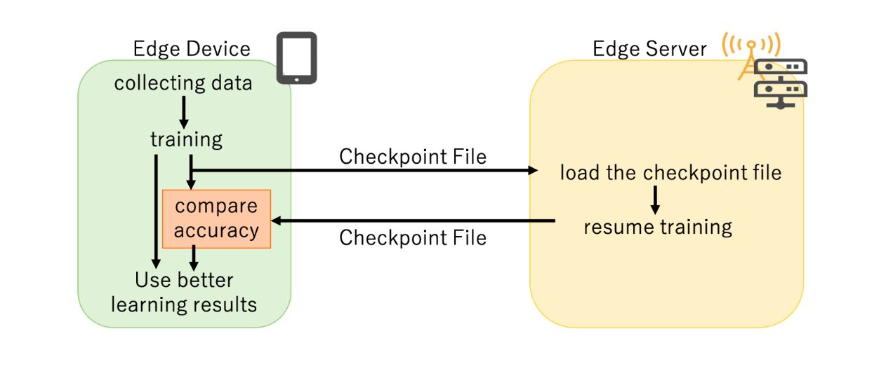

# Facial Image Recognition in Distributed Machine Learning using Rich Clients

## Team Name: Sync Squad

### Project Memebrs
1. Jaimin Vyas
2. Aniket Patel
3. Arjun Vaghasiya
4. Yagnik Beladiya

### Link: [Live Project Link](https://distributed-computation-fir-rich-clients-bbkmvjs6oqwuyhkeeyaet.streamlit.app/) 

### Project Overview
This project focuses on **Facial Image Recognition** using a **Distributed Machine Learning** approach. It leverages the power of **rich clients** for improved performance and scalability. The project is designed to demonstrate how distributed computing techniques can be used to train and deploy models efficiently.

### Workflow


### Key Features
- **Facial Recognition**: Utilizes machine learning algorithms to identify and verify faces from images.
- **Distributed Machine Learning**: Implements a distributed system where multiple clients work together to process data.
- **Rich Clients**: Ensures the client-side machines handle complex tasks to offload work from central servers, improving scalability.
- **Real-time Processing**: Designed for real-time facial recognition use cases.

### Tech Stack
- **Python**: Core language for implementing the distributed system.
- **TensorFlow/Keras**: Machine learning library used for building the facial recognition model.
- **streamlit**: A micro web framework for developing the backend.
- **Rich Client Architecture**: Ensures the clients handle substantial processing tasks.
  
### Installation

#### Prerequisites
- Python 3.7+
- TensorFlow, Keras, and other machine learning dependencies
- streamlit for running the server
- OpenCV for image processing

#### Steps
1. Clone the repository:
   ```bash
   git clone https://github.com/jaimincr7/distributed-computation-fir-rich-clients
2. Navigate to the project directory:
   ```bash
   cd distributed-computation-fir-rich-clients
3. Install dependencies:
   ```bash
   pip install -r requirements.txt

4. Run the Streamlit application:
   ```bash
    streamlit run app.py

### Usage
1. Run the Streamlit application:
   ```bash
   streamlit run app.py
   
2. Access the web app via your browser (Streamlit will provide a local URL, typically [http://localhost:8501](http://localhost:8501)).
3. Upload facial images through the interface, and the system will recognize and verify the faces in real-time, demonstrating the distributed machine learning approach.

### Project Structure
```bash
├── README.md                             # Project documentation
├── app.py                                # Streamlit application for facial recognition
├── distributed_facial_recognition.ipynb  # Jupyter notebook for facial recognition model training or analysis
├── requirements.txt                      # List of required dependencies for the project
```

This outlines the main files and folders for the project. If you need to add more details or specific folders/files, feel free to adjust it accordingly. Let me know if you need more information!

